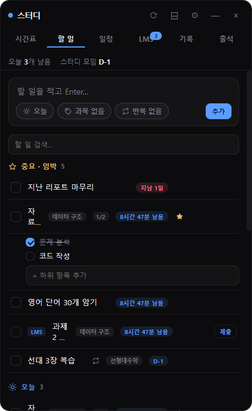
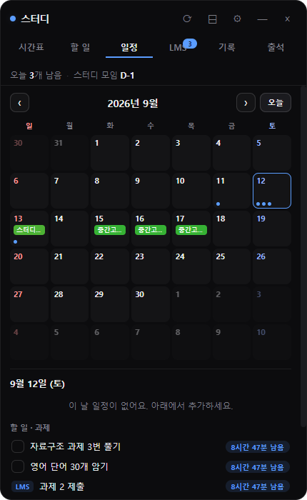
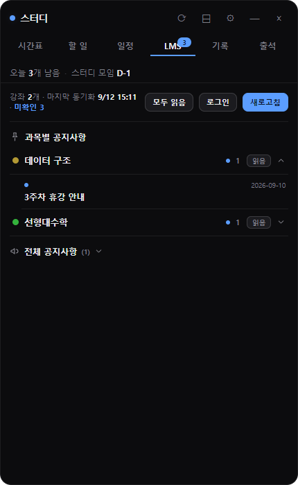
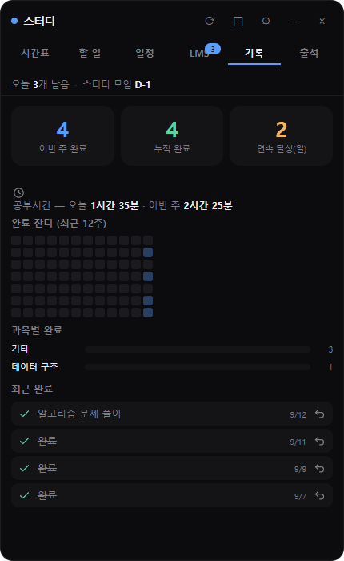
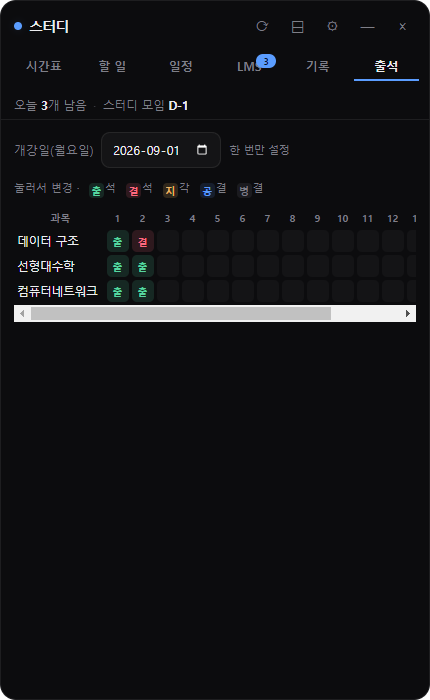

# 스터디 위젯 (충북대 LMS · 에브리타임 연동)

보조 모니터에 항상 띄워두고 쓰는 **공부용 데스크톱 위젯**입니다. 시간표·할 일·일정·LMS·출석·기록을 한 창에서 관리해요. (Electron · 프레임 없는 반투명 · 항상 위)

> 🏫 **충북대학교(coursemos LMS) 학생용**입니다. LMS 기능은 `lms.chungbuk.ac.kr` 기준이라 다른 학교에서는 LMS 탭이 동작하지 않아요. (시간표·할 일·일정·출석·기록은 학교와 무관하게 사용 가능)

## 미리보기
| 할 일 | 일정 | LMS |
|:---:|:---:|:---:|
|  |  |  |
| **기록** | **출석** | |
|  |  | |

## 주요 기능
- **시간표** — 에브리타임 공유 링크로 시간표 표시(과목 자동 인식)
- **할 일** — 과목별 To-do, 오늘/예정/과목/잔업 자동 분류, 마감 D-day·당일 시간 카운트다운, 별표(중요·임박), 반복(매일/매주), 하위 체크리스트, 검색, 완료 실행취소
- **일정** — 월 달력, 시험기간(기간) 표시, 날짜 클릭해 클릭식으로 추가, 미리 알림
- **LMS** — 과제(마감시간)·과목별 공지(과목 접이식)·전체 공지, 안 읽은 글 뱃지/모두 읽음. **로그인은 위젯 안 LMS 창에서 직접**(아이디·비밀번호는 앱이 저장·취급하지 않음), 세션만 재사용
- **출석** — 과목×주차 표, 지난 수업 자동 출석, 클릭으로 출석·결석·지각·공결·병결 토글
- **기록** — 이번주/누적 완료·연속 달성(streak)·과목별·공부시간·완료 잔디(히트맵)
- **집중 타이머(뽀모도로)**, 상단 요약 바, 라이트/다크 테마, 미니 모드, 자동 백업, 데스크톱 알림

## 설치 & 실행
1. [Node.js](https://nodejs.org) 설치 (LTS 권장)
2. 이 저장소를 받은 뒤 폴더에서:
   ```bash
   npm install
   npm start
   ```
3. **첫 설정**: 시간표 탭 → “공유 링크 등록” → 에브리타임 시간표 **공유 URL**(`everytime.kr/@xxxx`, 공개 상태) 붙여넣기 → 저장.
   LMS를 쓰려면 LMS 탭 → 로그인(뜨는 LMS 창에서 직접 로그인) → 새로고침.

### 배경에서 조용히 실행 / 윈도우 시작 시 자동 실행
- 폴더의 `시간표위젯.vbs`를 더블클릭하면 콘솔 없이 실행됩니다.
- 자동 시작: `Win+R` → `shell:startup` → 그 폴더에 `시간표위젯.vbs` **바로가기**를 넣어두세요.

## 개인정보 / 데이터
- 로그인 **비밀번호는 저장하지 않습니다.** LMS 세션 쿠키만 로컬에 유지해 재사용해요.
- 할 일·일정·출석 등 데이터는 내 PC에만 저장됩니다: `%APPDATA%/everytime-widget/config.json` (7일마다 `backups/`에 자동 백업). 외부로 전송하지 않습니다.

## 기술
Electron + 바닐라 JS/HTML/CSS. 외부 서버·계정 없음.

## 라이선스
MIT
