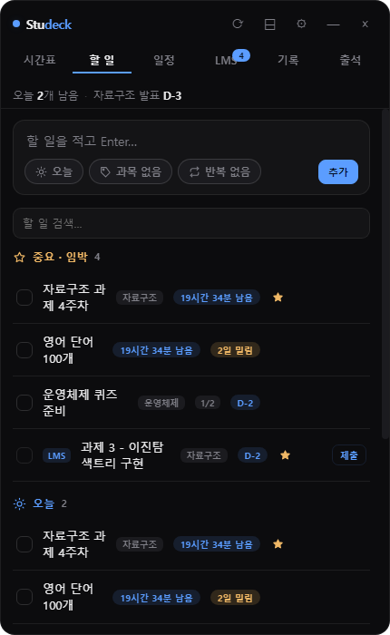
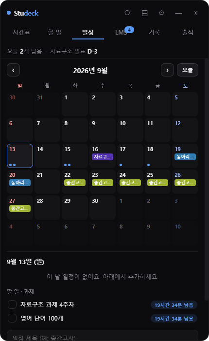
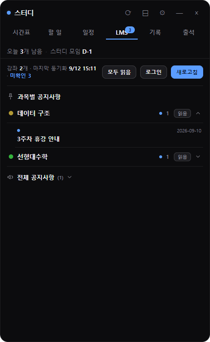
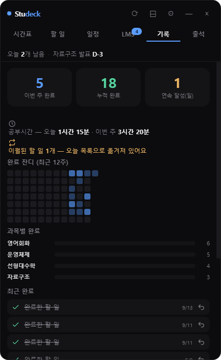
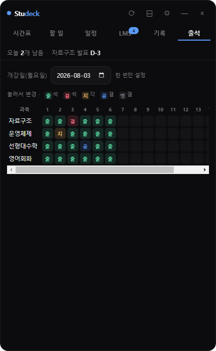
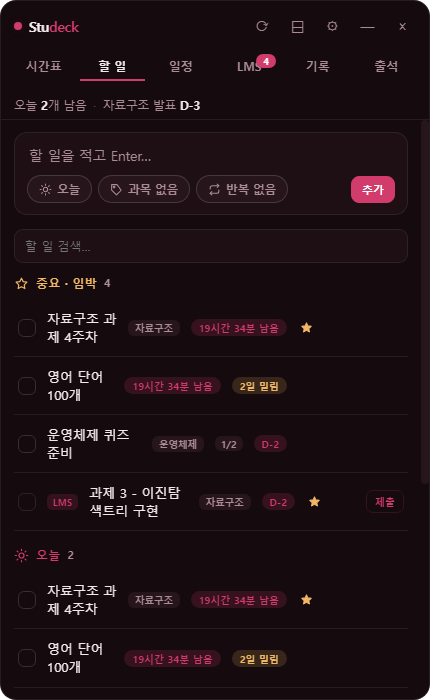

# 스터디 위젯 (충북대 LMS · 에브리타임 연동)

보조 모니터에 항상 띄워두고 쓰는 **공부용 데스크톱 위젯**입니다. 시간표·할 일·일정·LMS·출석·기록을 한 창에서 관리해요. (Electron · 프레임 없는 반투명 · 항상 위)

> 🏫 **충북대학교(coursemos LMS) 학생용**입니다. LMS 기능은 `lms.chungbuk.ac.kr` 기준이라 다른 학교에서는 LMS 탭이 동작하지 않아요. (시간표·할 일·일정·출석·기록은 학교와 무관하게 사용 가능)

## 미리보기
| 할 일 | 일정 | LMS |
|:---:|:---:|:---:|
|  |  |  |
| **기록** | **출석** | **충북대 테마** |
|  |  |  |

## 주요 기능
- **시간표** — 에브리타임 공유 링크로 시간표 표시(과목 자동 인식)
- **할 일** — 과목별 To-do, 오늘/예정/과목/잔업 자동 분류, 마감 D-day·당일 시간 카운트다운, 별표(중요·임박), 반복(매일/매주), 하위 체크리스트, 검색, 완료 실행취소
- **일정** — 월 달력, 시험기간(기간) 표시, 날짜 클릭해 클릭식으로 추가, 미리 알림
- **LMS** — 과제(마감시간)·과목별 공지(과목 접이식)·전체 공지, 안 읽은 글 뱃지/모두 읽음. **로그인은 위젯 안 LMS 창에서 직접**(아이디·비밀번호는 앱이 저장·취급하지 않음), 세션만 재사용
- **출석** — 과목×주차 표, 지난 수업 자동 출석, 클릭으로 출석·결석·지각·공결·병결 토글
- **기록** — 이번주/누적 완료·연속 달성(streak)·과목별·공부시간·완료 잔디(히트맵)
- **집중 타이머(뽀모도로)**, 상단 요약 바, **테마 5종**(다크·라이트·**충북대**·백준·회색), 미니 모드, 자동 백업, 데스크톱 알림

## 설치 & 실행

### 방법 A — 그냥 다운로드해서 쓰기 (권장, Node 불필요)
[**Releases**](https://github.com/kjh3291/study-widget/releases)에서 최신 파일을 받으세요.
- `StudyWidget-x.y.z-Setup.exe` — 더블클릭하면 설치되고 시작 메뉴/바탕화면에 바로가기가 생겨요.
- `StudyWidget-x.y.z-Portable.exe` — 설치 없이 더블클릭하면 바로 실행(USB에 넣어 다녀도 OK).

> ⚠️ 개인 제작 앱이라 서명이 없어, 처음 실행 시 Windows SmartScreen이 뜰 수 있어요 → **추가 정보 → 실행**을 누르면 됩니다.

**맥(macOS)**: `StudyWidget-x.y.z-mac-arm64.dmg`(애플 실리콘) 또는 `-x64.dmg`(인텔)를 받으세요. 앱 이름은 `StudyWidget.app`이며 앱 내부 화면은 한국어입니다. electron-builder의 기본 ad-hoc 서명(`mac.identity: "-"`)을 사용하지만, 애플 공증(notarization)이 없어 처음 열 때 Gatekeeper 경고가 뜹니다. 다음 중 하나로 여세요:
> - **우클릭 → 열기** → 경고 창에서 다시 **열기**, 또는
> - 앱을 `응용 프로그램`에 옮긴 뒤 터미널에서 격리 속성 제거:
>   ```bash
>   xattr -dr com.apple.quarantine "/Applications/StudyWidget.app"
>   ```

### 방법 B — 소스로 실행 (개발자용)
1. [Node.js](https://nodejs.org) 설치 (LTS 권장)
2. 저장소를 받은 뒤 폴더에서:
   ```bash
   npm install
   npm start
   ```

### 첫 설정 (공통)
- 시간표 탭 → “공유 링크 등록” → 에브리타임 시간표 **공유 URL**(`everytime.kr/@xxxx`, 공개 상태) 붙여넣기 → 저장.
- LMS를 쓰려면 LMS 탭 → 로그인(뜨는 LMS 창에서 직접 로그인) → 새로고침.

### 직접 빌드하기 (exe 만들기)
```bash
npm install
npm run dist
```
`dist/` 폴더에 설치본(Setup)과 포터블(Portable) exe가 생성됩니다.

### 윈도우 시작 시 자동 실행
- **설치본(exe) 사용 시**: 위젯 **설정 → "윈도우 시작 시 자동 실행"** 체크 한 번이면 끝. 부팅할 때 아이콘과 함께 자동으로 떠요.
- **소스로 실행 시**: 폴더의 `시간표위젯.vbs`를 `Win+R` → `shell:startup` 폴더에 **바로가기**로 넣어두면 콘솔 없이 자동 실행됩니다.

## 개인정보 / 데이터
- 로그인 **비밀번호는 저장하지 않습니다.** LMS 세션 쿠키만 로컬에 유지해 재사용해요.
- 할 일·일정·출석 등 데이터는 내 PC에만 저장됩니다: `%APPDATA%/everytime-widget/config.json` (7일마다 `backups/`에 자동 백업). 외부로 전송하지 않습니다.

## 기술
Electron + 바닐라 JS/HTML/CSS. 외부 서버·계정 없음.

## 라이선스
MIT

### 맥 ↔ 윈도우 전체 동기화

양쪽 기기에서 **공통 설정 동기화를 지원하는 같은 버전**을 설치하고 동일한 비공개 GitHub 저장소를 연결하세요. 처음 연결할 때 기존 원격 할 일·일정을 먼저 적용합니다. 변경 사항은 약 8초 후, 외부에서 넣은 자료와 다른 기기의 변경 사항은 앱 실행 중 약 1분 간격으로 동기화합니다. 기기를 바꾸기 전에는 `지금 동기화`의 완료 표시를 확인하세요.

- 공유: `Studeck`의 수업자료·보조자료·과제, 할 일·하위 항목·일정·공부 기록·출석·과목·시간표, 공지 읽음/별표, 테마·시계·집중 목표·알림·자동 이월·LMS 자동 새로고침·자료 자동받기/과목별 선택·투명도·항상 위 설정.
- 기기별 유지: GitHub 토큰·LMS 로그인 쿠키, 다운로드 완료 기록의 절대 경로, 창 위치/크기, 자동 시작, 미니 모드. 실행 중인 타이머 대신 완료된 공부 기록을 공유합니다.
- 구버전에서 한 번도 올리지 않은 윈도우 설정은 저장소에서 복구할 수 없습니다. 양쪽을 업데이트한 뒤 원하는 설정을 한 기기에서 적용하고 동기화하세요.
- 같은 파일을 양쪽에서 동시에 바꾸면 충돌을 표시하고 업로드를 중단합니다. 강제로 덮어쓰지 않습니다. 대용량 파일은 GitHub의 파일 크기 제한을 따릅니다(LFS 자동 설정은 포함하지 않습니다).

### 제출 과제 파일 갱신
LMS 새로고침 때 내 제출 파일을 다시 확인합니다. 같은 이름의 재제출 파일은 내용이 달라지면 최신 파일로 교체하고, 이전 내용은 로컬 `Studeck/.studeck/backups/submissions`에 백업합니다. 이름이 바뀐 제출물은 새 파일로 저장하며 이전 이름의 파일은 자동 삭제하지 않습니다. 자동받기를 끈 과목은 강제 받기 전까지 갱신하지 않습니다.
